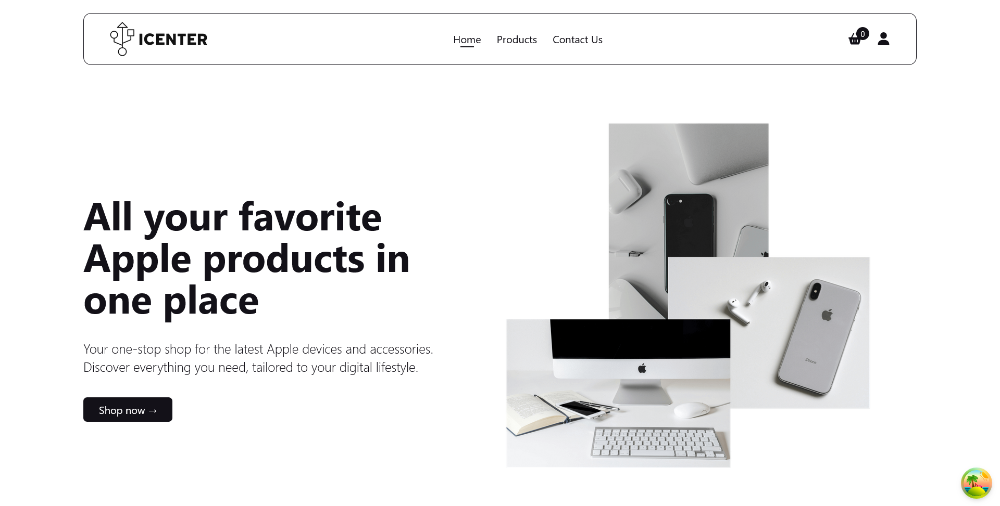

<p align="center">
  
</p>

All your favorite Apple products in one place. **ICENTER** is sleek and minimalistic e-commerce website where users can purchase latest Apple devices and accessories.

## Table of contents

- [User features](#-user-features-user-side)
- [Admin features](#-admin-features-admin-side)
- [Live preview](#-live-preview)
- [Tech stack](#-tech-stack)
- [Screenshot](#-screenshot)
- [Installation](#-installation)
- [Development](#-development)
- [Developer](#-developer)
- [Contributing](#-contributing)

## 👾 User Features (User Side)

🛒 **Shopping and Browsing**

- Product listing with categories
- Product detail page with:
  - Name, price, description, specifications
  - Product images/gallery
  - Available stock
  - Rating and reviews
- Search functionality
- Filter and sort products

👤 **Authentication**

- User registration and login
- Password update
- Secure sessions (cookies and tokens)
- View and update profile

🛍️ **Cart**

- Add to cart
- View cart and update quantities
- Remove items from cart

📦 **Checkout & Orders**

- Shipping address form
- Choose payment method (Cash on Delivery)
- Place order functionality

📬 **Order Management**

- View past orders
- Order status tracking

⭐ **Reviews & Ratings**

- Leave review after delivery

- View other users' reviews

## ⚙️ Admin Features (Admin Side)

📦 **Product Management**

- Add new products
- View all products
- Edit existing products
- Delete product
- Track inventory (stock levels)

📃 **Order Management**

- View all orders
- Update order status
- Update user order information
- Mark orders as paid or delivered

## 🚀 Live Preview

You can view the live preview of the project by visiting: <a href="https://icenter-shop.vercel.app/" target="_blank">https://icenter-shop.vercel.app/</a>

## 💻 Tech Stack

📜 **Frontend**

[](#)
[](#)
[](#)
[](#)
[](#)
[](#)


🗄️ **Backend**

[](#)
[](#)

🛢️ **Database**

[](#)

## 📷 Screenshot

  

## ⚙️ Installation

Follow the steps below to set up the project locally:

1.  **Fork the repository**  
    Click the **Fork** button at the top-right corner of this page to copy the repository to your GitHub account.

2.  **Clone the repository**

    ```bash
    git clone https://github.com/<your-username>/icenter.git
    ```

3.  **Create .env file**: Inside the frontend, admin, and server directories create `.env` file and set:

Frontend:
`VITE_BACKEND_URL=<your_server_url>`

Admin:
`VITE_BACKEND_URL=<your_server_url>`

Backend:

```
  MONGODB_URI=<your_mongodb_uri>
  MONGODB_PASSWORD=<your_db_password>

  JWT_SECRET=<your_jwt_secret>
  JWT_EXPIRES_IN=<e.g. 90d>
  JWT_COOKIE_EXPIRES_IN=<e.g. 90>

  CLOUDINARY_NAME=<your_cloudinary_name>
  CLOUDINARY_API_KEY=<your_api_key>
  CLOUDINARY_SECRET_KEY=<your_secret_key>

  FRONTEND_DEV_ORIGIN=http://localhost:5173
  ADMIN_DEV_ORIGIN=http://localhost:5174

  NODE_ENV=development
  PORT=3000
```

4. **Install dependencies**

```bash
  npm i # Run this command in frontend, admin, and backend directories
```

> [!NOTE]  
> In the backend, please install nodemon by running `npm i nodemon` in the backend directory terminal.
> 
> This is because I installed nodemon globally in my local machine : )

5. **Start development environments**:

Frontend:

```bash
cd frontend
npm run dev
```

Admin:

```bash
cd admin
npm run dev
```

Admin:

```bash
cd backend
npm run server
```

6. Access

Frontend:
`http://localhost:5173/`

Admin:
`http://localhost:5174/`

## ✨ Development

Features for next update:

- **Admin dashboard**: Implement an admin dashboard where statistics are shown (e.g. sales, income, etc.)
- **Password resets**: Allow user to reset their password
- **Emails**: Send emails to user for password reset and order receipts

## 🧑‍💻 Developer

<table>
  <tbody>
    <tr>
      <td align="center" valign="top">
        
        <br />
        <b>Exequiel Arco</b>
      </td>
    </tr>
    <tr>
        <td align="center">
            <a href="https://github.com/quielScript" target="_blank">
            
            </a>
            <br/>
            <a href="https://www.linkedin.com/in/exequielarco" target="_blank">
            
            </a>
        </td>
    </tr>
  </tbody>
</table>


<!--- [](https://github.com/quielScript)
 [](https://www.linkedin.com/in/exequielarco/) --->


## 🌟 Contributing

Contributions are welcome!
